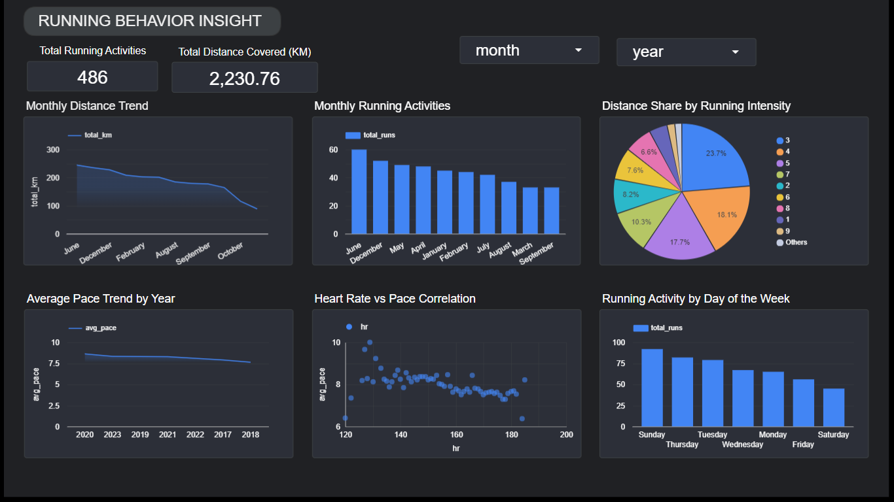

# Strava Running Analysis Dashboard

This project analyzes personal Strava running data (2017–2023) to evaluate running trends, performance, and behavior using SQL (BigQuery) and a dashboard.

## Key Insights
Running distance shows a declining trend over time
Running frequency has decreased in recent months
Pace performance slightly improves (better efficiency)
Higher heart rate correlates with faster pace
Most runs occur on Sunday, least on Saturday
Majority of runs are within 3–5 KM distance

## Tools
Google BigQuery (SQL)
Looker Studio

## SQL Queries

All SQL queries used for data cleaning, transformation, and analysis are included in this repository.
